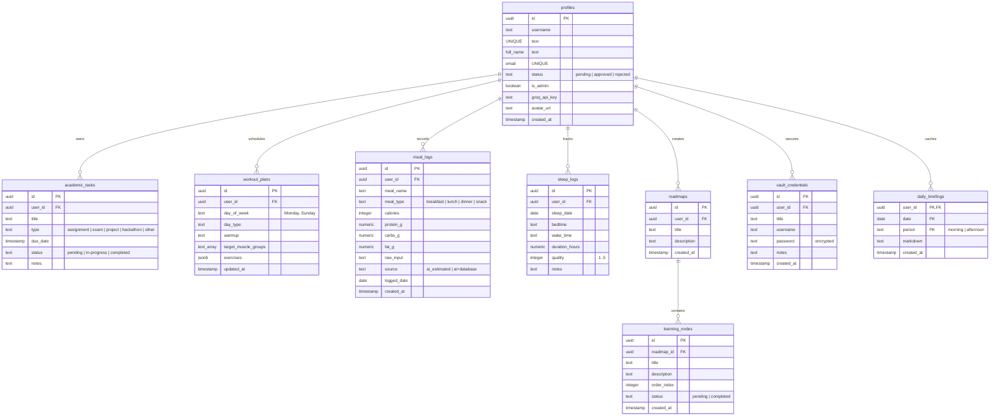

# Mayaz OS — System Architecture & Progress Analysis

Welcome to the comprehensive, developer-ready blueprint and system architecture review of **Mayaz OS** (Journey). This document provides an in-depth breakdown of the current technical design, system components, database models, AI integrations, security barriers, and implementation status.

---

## 💻 Tech Stack & System Architecture

Mayaz OS is constructed as a modern, high-performance, real-time life management application using a cutting-edge server-first model.

### Core Stack
* **Framework**: Next.js 15+ (App Router, dynamic server rendering, Server Actions for mutations).
* **Database & Authentication**: Supabase (PostgreSQL, custom PL/pgSQL triggers, secure `SECURITY DEFINER` RPCs, Row Level Security (RLS)).
* **AI Orchestration**: Groq SDK (powering ultra-fast, context-grounded LLaMA 3.1 8B Instant execution).
* **Styling**: Premium custom HSL CSS custom properties (variables) featuring a luxurious, glassmorphic dark-mode palette, Outlined typography, and responsive CSS Grid/Flexbox layouts.
* **Component Motion**: Framer Motion (delivering butter-smooth transitions, sliding navigation, and glass sheet drawer slides).

---

## 🗄️ Database Schema & Relational Models

The database is built on **Supabase PostgreSQL** with strict data isolation enforced via **Row Level Security (RLS)**, ensuring users only read and write their own data.



---

## 🛠️ Feature Components & Business Logic

### 1. 🚦 Quarantine Sign-up & Admin Approval System
* **Auto-Quarantine**: Newly registered accounts are default quarantine-gated with `status = 'pending'` and `is_admin = false`. 
* **Quarantine Routing**: Next.js middleware / layout logic dynamically intercepts users whose status is not `'approved'`, redirecting them to quarantine screens (`/pending` or `/rejected`).
* **Admin Notifications**: Active administrators receive live real-time notifications on their homepage when a new profile registers.
* **Live Gating Control**: Admins can approve or reject profiles directly in the dashboard, updating the user state instantly via Supabase triggers.

### 2. 🔑 Username & Email Dual-Login
* **RLS Bypass Lookup**: Built a highly secure PostgreSQL RPC function `resolve_username_to_email(username)`. Since profiles are protected by RLS, standard auth forms cannot read other profiles' emails. This `SECURITY DEFINER` function securely checks the username against database records and returns the corresponding email.
* **Unified Client Forms**: The login screen dynamically parses the input. If a username is inputted, it calls the database to resolve the email, then signs the user in seamlessly using Supabase's native Auth engine.

### 3. 🧠 Rich Timezone-Aware RAG AI Chat Panel
* **Dynamic Time Injection**: The chat client in [HomeChatPanel.tsx](file:///Users/mayazad/ads_journey/src/components/HomeChatPanel.tsx) dynamically computes the user's exact browser-resolved local date, time, and day of the week (e.g. `Sunday, May 17, 2026, 09:10 PM`) and sends it directly in the client-to-server payload.
* **Comprehensive RAG Snapshots**: The server gathers your complete weekly workout schedules, pending academic task timelines, and learning roadmaps into a structured grounding context snapshot.
* **Anti-Hallucination Guardrails**: The system instructions in [src/actions/ai.ts](file:///Users/mayazad/ads_journey/src/actions/ai.ts) enforce strict boundaries. The AI is forbidden from inventing dummy corporate events (like "marketing meetings" or "sales reviews") and will accurately tell you exactly what is scheduled inside your actual database.

### 4. 📈 Fitness & Precision Nutrition Tracking
* **Casual Nutrition Parsing**: Powered by Groq, users can type casual sentences like *"Had 2 fried eggs, a banana, and a glass of milk for breakfast"*. The AI parses the ingredients and estimates serving sizes.
* **Open Food Facts Cross-Check**: The server takes the primary ingredient and executes a background fetch to the public **Open Food Facts API** to extract real-world database macronutrients, falling back to LLaMA's built-in nutrition database for missing products.
* **Comprehensive Metrics**: Tracks sleep logs (bedtime, wake time, duration, quality score) and generates actionable wellness insights tailored to the logged macros and activity.

### 5. 🗺️ Learning Roadmap Architect
* **Unstructured-to-Node Converter**: Users can paste block text, notes, or AI outlines into the Learning module. The AI automatically compiles, sequences, and translates it into a structured, interactive visual node sequence.
* **Dynamic Node Progress**: Users track and check off nodes one by one to complete their personalized learning path.

---

## 🔒 Security Architecture & Access Controls

1. **Row Level Security (RLS)**: Enforced on all tables. Queries automatically map to the authenticated user's ID (`auth.uid()`), completely preventing cross-user data leakage.
2. **Vault Isolation**: Data logged in the encrypted **Vault** is strictly shielded; AI models and external prompts are structurally locked out from ever accessing this table.
3. **Admin Self-Deletion Lockout**:
   * **UI Gating**: In settings, the **Danger Zone** displays a disabled banner for administrators: `🛡️ Administrators cannot self-delete to prevent system lockouts.`
   * **Database Trigger Protection**: The backend RPC function `delete_own_user()` executes a strict internal check:
     ```sql
     IF EXISTS (SELECT 1 FROM public.profiles WHERE id = auth.uid() AND is_admin = true) THEN
       RAISE EXCEPTION 'Administrators cannot self-delete their accounts to prevent lockout.';
     END IF;
     ```
     This blocks API-direct attempts to delete an administrative account, safeguarding system stability.

---

## 📈 System Progress Checklist

### Core Architecture & Framework
- [x] Next.js 15 project setup with App Router
- [x] Supabase backend configuration & active client middleware
- [x] Row Level Security (RLS) policies implemented on all tables
- [x] Dynamic global HSL dark/light premium design system

### Quarantine & Account Gating
- [x] Gated sign-up quarantine state machine (`status: pending`)
- [x] Quarantine dashboard redirection loops solved
- [x] Dynamic admin pending-user approval notification systems
- [x] Real-time approval / rejection state updates

### Authentication & Profiles
- [x] Dual Username & Email secure sign-in resolution
- [x] Full Name, Username, and Avatar upload management in Settings
- [x] Daily Briefing Cache clearance settings
- [x] Danger Zone: secure account deletion with admin self-deletion blocking

### AI Integration & RAG Engine
- [x] Bi-daily cached Daily Briefing generations (morning/afternoon)
- [x] Browser-time synchronized timezone calculations
- [x] High-fidelity weekly RAG snapshot injection (entire week workout + task calendars)
- [x] Temperature-controlled, anti-hallucination chat grounding prompts

### Core Productivity Features
- [x] **Academics**: AI-assisted tasks, status transitions, and timeline tracking
- [x] **Fitness**: Open Food Facts integrated nutrition macro parsing, sleep quality trackers, and wellness coaches
- [x] **Learning**: Dynamic unstructured text roadmap converters and node checklist managers
- [x] **Vault**: Encrypted private credentials storage protected under RLS isolation

---

*This document is maintained as a living blueprint of Mayaz OS. Last analyzed: May 17, 2026.*
